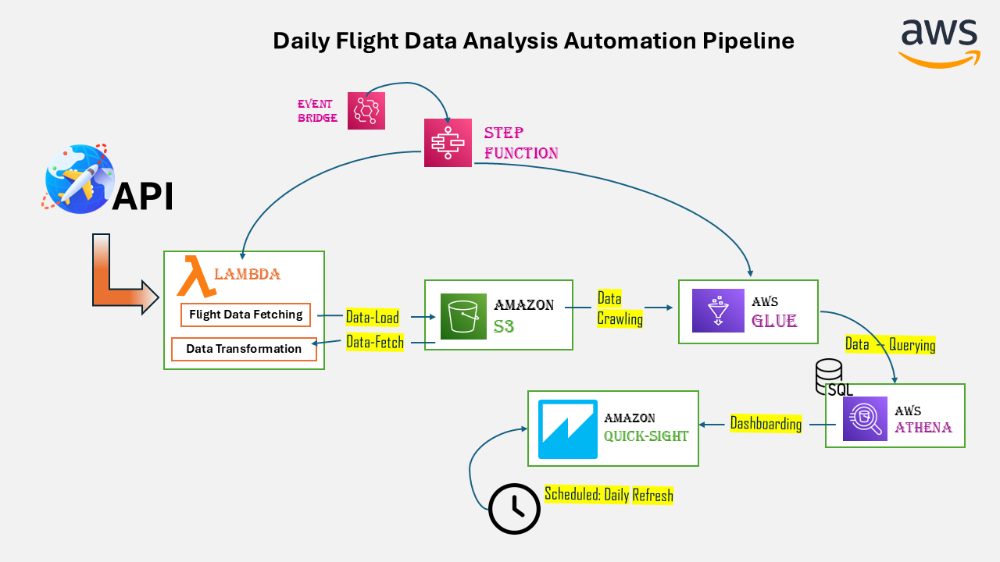
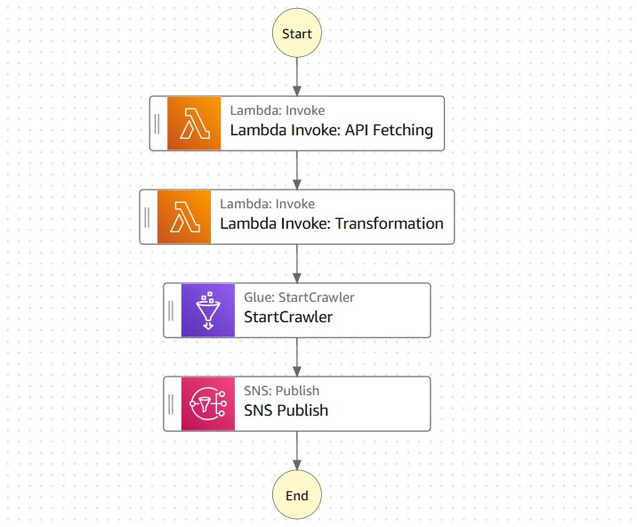
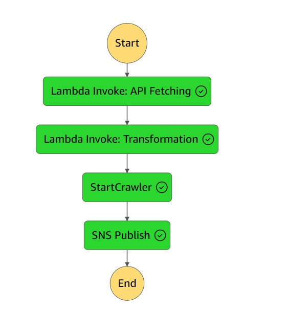
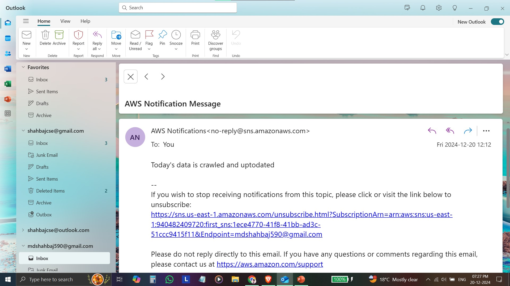

# Daily Flight Data Analysis Automation Pipeline

**Table of Contents:**

- [Introduction](#introduction)
- [Project Architecture](#project-architecture)
- [Steps in the Pipeline](#steps-in-the-pipeline)
  - [Step 1: Fetching and Storing Raw Flight Data](#step-1-fetching-and-storing-raw-flight-data)
  - [Step 2: Data Transformation and Processing](#step-2-data-transformation-and-processing)
  - [Step 3: Metadata Management](#step-3-metadata-management)
  - [Step 4: Querying and Visualization](#step-4-querying-and-visualization)
- [Automation](#automation)
- [Technology Used](#technology-used)
- [How to Run](#how-to-run)
- [References](#references)

## Introduction

The Daily Flight Data Analysis Automation Pipeline is a comprehensive project designed to automate the fetching, transformation, storage, querying, and visualization of daily flight data. This pipeline ensures seamless daily updates and insights from flight data while maintaining automation through AWS services and step functions.

---

## Project Architecture

The architecture of the pipeline is designed to handle each step in an automated fashion. Below is the architectural diagram of the project:

## Steps in the Pipeline

### Step 1: Fetching and Storing Raw Flight Data

- **Source:** Flight data is fetched daily from aviationstack.com API.
- **Process:**
  - A Lambda function triggers the API to fetch the latest flight data.
  - The raw flight data is stored in an S3 bucket, partitioned by the current date.
- **Output:** Raw data is available in S3 for further processing.

### Step 2: Data Transformation and Processing

- **Source:** The raw flight data stored in S3.
- **Process:**
  - Another Lambda function retrieves the raw data from the S3 bucket.
  - Data is transformed to align with the requirements of the target dashboard insights.
  - The processed data is stored in a separate S3 bucket named "processed bucket," partitioned by the current date.
- **Output:** Transformed data is ready for metadata creation and querying.

### Step 3: Metadata Management

- **Tool:** AWS Glue Crawler
- **Process:**
  - A Glue Crawler scans the processed flight data in the S3 "processed bucket."
  - Metadata is created and maintained in the AWS Glue Data Catalog.
- **Output:** A structured schema of the processed flight data for querying.

### Step 4: Querying and Visualization

- **Tools:** AWS Athena and Amazon QuickSight
- **Process:**
  - Glue Catalog is connected to AWS Athena to enable SQL-like querying of the data.
  - Athena is further connected to Amazon QuickSight to create interactive dashboards.
  - Dashboards are scheduled to refresh daily to provide up-to-date flight insights.
- **Output:** Visualizations and insights into daily flight data.

## Automation

- **AWS Step Functions:** Used to orchestrate the automation of the entire pipeline.
  - The pipeline is triggered daily by an EventBridge rule scheduled using a cron expression.
  - The cron expression is set to trigger the pipeline around midnight (11:00 PM).
  - The Step Function triggers the Lambda functions for fetching and transforming data.
  - The Glue Crawler is started to update metadata.
  - An SNS notification is sent upon the successful crawling of the day's flight data.

- **Dashboard Refresh:** The QuickSight dashboards are scheduled to refresh daily at 11:10 PM, ensuring the latest flight data insights are available.

- **Email Notification:** After the dashboard is refreshed, an email notification is sent to the users with access to the dashboard. The notification includes options such as "View Dashboard" to allow easy access to the updated insights.

The following images illustrate the automation:

- **Step Function Graph:**
  
  
- **Step Function Execution:**
  
  
- **SNS Notification:**
  An SNS email notification confirms the successful completion of the pipeline each day and includes the "View Dashboard" option for users with access.
 

---

## Technology Used

- **AWS Lambda:** For executing the functions to fetch and transform data.
- **Amazon S3:** For storing raw and processed flight data.
- **AWS Glue:** For metadata management and creating a data catalog.
- **AWS Athena:** For querying the data using SQL-like syntax.
- **Amazon QuickSight:** For creating interactive dashboards and visualizations.
- **AWS Step Functions:** For orchestrating the entire pipeline.
- **Amazon EventBridge:** For scheduling the daily trigger of the pipeline.
- **Amazon SNS:** For sending notifications upon completion of each pipeline task.

---

## How to Run

### Setup:

1. **Configure AWS Services:**
   - Set up AWS Lambda, S3, Glue, Athena, QuickSight, Step Functions, and SNS.
2. **Obtain API Key:**
   - Get an API key from [aviationstack.com](https://aviationstack.com).

### Execution:

1. **Deploy Lambda Functions and Step Function Workflow:**
   - Deploy the Lambda functions to fetch and process data: 1. [fetch_flight_data.py](fetch_flight_data.py)  2. [flight_data_transformation.py](flight_data_transformation.py)
   - Set up the Step Function to orchestrate these tasks.

2. **Schedule Triggers:**
   - Schedule daily triggers for data fetching and QuickSight dashboard refresh.

### Monitor:

1. **Verify Successful Data Crawling:**
   - Check SNS notifications for confirmation of successful Glue Crawler execution.
2. **Check QuickSight Dashboard:**
   - Ensure the QuickSight dashboard reflects the latest insights.

## References

- [AviationStack API Documentation](https://aviationstack.com)
- [AWS Glue Documentation](https://docs.aws.amazon.com/glue/latest/dg/what-is-glue.html)
- [Amazon QuickSight Documentation](https://docs.aws.amazon.com/quicksight/latest/user/welcome.html)
- [Python Lambda Function Documentation](https://docs.aws.amazon.com/lambda/latest/dg/welcome.html)

---

### Get In Touch

If you have any suggestions or would like to discuss this project further, feel free to reach out to me via email at [shahbajcse@gmail.com](mailto:shahbajcse@gmail.com).

You can also follow me on [LinkedIn](https://www.linkedin.com/in/mdshahbaj) for more updates on my projects and learning journey.

